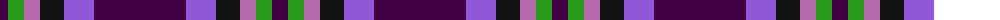
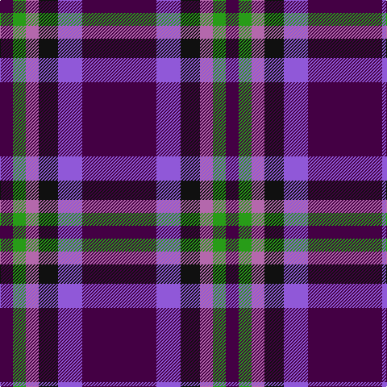

The parent of this is [Haut (Personal)](/tartans/dp/16/g16/pa16/k24/p30/dp/92/)

This was sourced from tartans-authority.  It is a [6 stripes tartan](/stripes/stripes6/).

Original link http://www.tartansauthority.com/tartan-ferret/display/10389/

## Thread count
DP/16 G16 Pa16 K24 P30 DP/92

## Palette
Each colour and its ΔE from the base-6 reference it is a variant of.

| Colour | Shade | Base | ΔE (OKLab) |
|---|---|---|---|
| DP |  `#440044` | B  | 0.17 |
| G |  `#289C18` | G  | 0.18 |
| K |  `#101010` | K  | 0.17 |
| P |  `#9058D8` | B  | 0.22 |
| Pa |  `#B468AC` | R  | 0.21 |

# Sample pattern

ID: /variants/dp/16/g16/pa16/k24/p30/dp/92-dp440044-g289c18-k101010-p9058d8-pab468ac/
