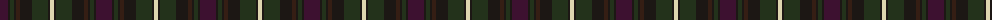

The parent of this is [Coffield-Limesand (Personal)](/tartans/dp/16/kb2/k4/kb2/ka4/kb12/k16/kb2/lr/4/)

This was sourced from register-of-tartans.  It is a [9 stripes tartan](/stripes/stripes9/).

Original link https://www.tartanregister.gov.uk/tartanDetails.aspx?ref=10596

## Thread count
DP/16 Kb2 K4 Kb2 Ka4 Kb12 K16 Kb2 LR/4

## Palette
Each colour and its ΔE from the base-6 reference it is a variant of.

| Colour | Shade | Base | ΔE (OKLab) |
|---|---|---|---|
| DP |  `#3D1130` | B  | 0.18 |
| K |  `#23321B` | G  | 0.17 |
| Ka |  `#351E14` | B  | 0.20 |
| Kb |  `#1C1714` | K  | 0.21 |
| LR |  `#DDD5AF` | W  | 0.11 |

ID: /variants/dp/16/kb2/k4/kb2/ka4/kb12/k16/kb2/lr/4-dp3d1130-k23321b-ka351e14-kb1c1714-lrddd5af/
