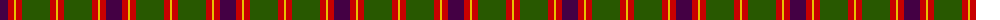
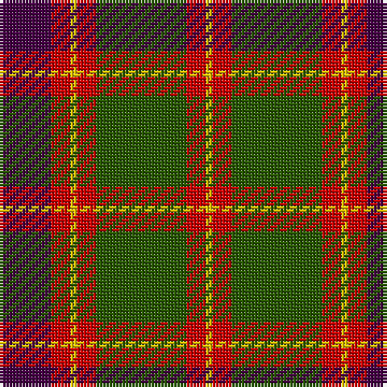

The parent of this is [Logan - 1819 (with yellow)](/tartans/dp/16/r6/y2/r6/g28/r6/y/2/)

This was sourced from tartans-authority.  It is a [7 stripes tartan](/stripes/stripes7/).

Original link http://www.tartansauthority.com/tartan-ferret/display/590/

## Thread count
DP/16 R6 Y2 R6 G28 R6 Y/2

## Palette
Each colour and its ΔE from the base-6 reference it is a variant of.

| Colour | Shade | Base | ΔE (OKLab) |
|---|---|---|---|
| DP |  `#440044` | B  | 0.17 |
| G |  `#285800` | G  | 0.04 |
| R |  `#C80000` | R  | 0.00 |
| Y |  `#E8C000` | Y  | 0.00 |

# Sample pattern

ID: /variants/dp/16/r6/y2/r6/g28/r6/y/2-dp440044-g285800-rc80000-ye8c000/
