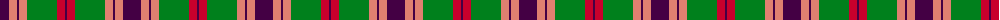
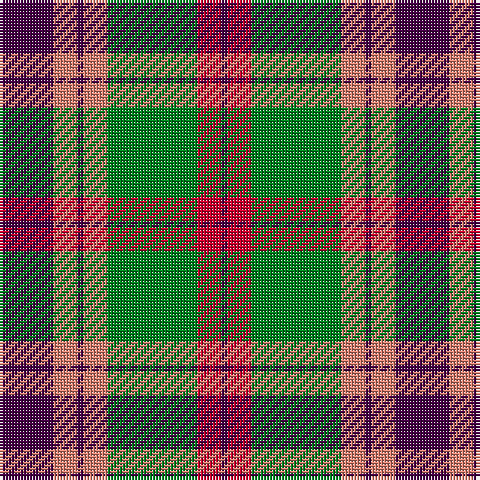

The parent of this is [Logan #3](/tartans/dp/18/lr8/dp2/lr8/g30/ra8/dp/2/)

This was sourced from register-of-tartans.  It is a [7 stripes tartan](/stripes/stripes7/).

Original link https://www.tartanregister.gov.uk/tartanDetails.aspx?ref=2183

## Thread count
DP/18 LR8 DP2 LR8 G30 Ra8 DP/2

## Palette
Each colour and its ΔE from the base-6 reference it is a variant of.

| Colour | Shade | Base | ΔE (OKLab) |
|---|---|---|---|
| DP |  `#440044` | B  | 0.17 |
| G |  `#00801C` | G  | 0.09 |
| LR |  `#E08070` | Y  | 0.20 |
| R |  `#C80000` | R  | 0.00 |
| Ra |  `#C8002C` | R  | 0.03 |

# Sample pattern

ID: /variants/dp/18/lr8/dp2/lr8/g30/ra8/dp/2-dp440044-g00801c-lre08070-rc80000-rac8002c/
