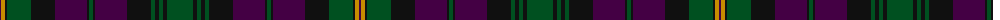

The parent of this is [Kettles, Ryan & Alan (Personal)](/tartans/dp/2/dy4/k2/g24/k24/dp32/k2/g4/k2/dp32/k24/g4/k4/g4/k4/g/26/)

This was sourced from register-of-tartans.  It is a [16 stripes tartan](/stripes/stripes16/).

Original link https://www.tartanregister.gov.uk/tartanDetails.aspx?ref=11061

## Thread count
DP/2 DY4 K2 G24 K24 DP32 K2 G4 K2 DP32 K24 G4 K4 G4 K4 G/26

## Palette
Each colour and its ΔE from the base-6 reference it is a variant of.

| Colour | Shade | Base | ΔE (OKLab) |
|---|---|---|---|
| DP |  `#440044` | B  | 0.17 |
| DY |  `#C88C00` | Y  | 0.15 |
| G |  `#005020` | G  | 0.08 |
| K |  `#101010` | K  | 0.17 |

ID: /variants/dp/2/dy4/k2/g24/k24/dp32/k2/g4/k2/dp32/k24/g4/k4/g4/k4/g/26-dp440044-dyc88c00-g005020-k101010/
