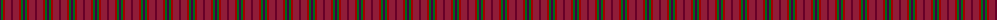
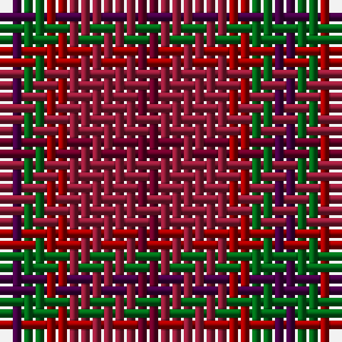

The parent of this is [Blairgowrie Berries and Cherries](/tartans/dp/2/g2/dr2/dra6/drb/2/)

This was sourced from tartans-authority.  It is a [5 stripes tartan](/stripes/stripes5/).

Original link http://www.tartansauthority.com/tartan-ferret/display/11150/

## Thread count
DP/2 G2 DR2 DRa6 DRb/2

## Palette
Each colour and its ΔE from the base-6 reference it is a variant of.

| Colour | Shade | Base | ΔE (OKLab) |
|---|---|---|---|
| DP |  `#440044` | B  | 0.17 |
| DR |  `#A00000` | R  | 0.09 |
| DRa |  `#901C38` | R  | 0.12 |
| DRb |  `#680028` | B  | 0.20 |
| G |  `#006818` | G  | 0.02 |

# Sample pattern

ID: /variants/dp/2/g2/dr2/dra6/drb/2-dp440044-dra00000-dra901c38-drb680028-g006818/
