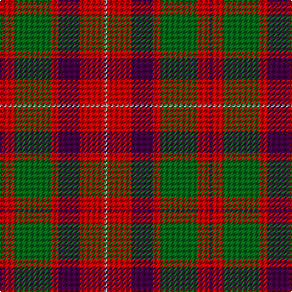

The parent of this is [Geddes (Clan)](/tartans/dp/2/r10/g30/r6/dp18/r20/ln/2/)

This was sourced from tartans-authority.  It is a [7 stripes tartan](/stripes/stripes7/).

Original link http://www.tartansauthority.com/tartan-ferret/display/4969/

## Thread count
DP/2 R10 G30 R6 DP18 R20 LN/2

## Palette
Each colour and its ΔE from the base-6 reference it is a variant of.

| Colour | Shade | Base | ΔE (OKLab) |
|---|---|---|---|
| DP |  `#440044` | B  | 0.17 |
| G |  `#006818` | G  | 0.02 |
| LN |  `#E0E0E0` | W  | 0.06 |
| R |  `#C80000` | R  | 0.00 |

# Sample pattern

ID: /variants/dp/2/r10/g30/r6/dp18/r20/ln/2-dp440044-g006818-lne0e0e0-rc80000/
