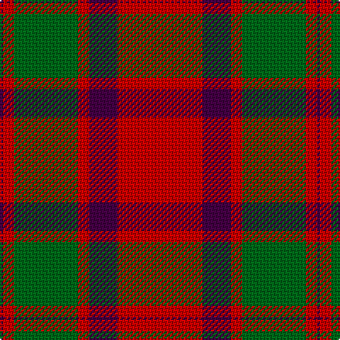

The parent of this is [Caledonian - 1819 (Fashion?)](/tartans/dp/2/r8/g45/r8/dp20/r/60/)

This was sourced from tartans-authority.  It is a [6 stripes tartan](/stripes/stripes6/).

Original link http://www.tartansauthority.com/tartan-ferret/display/526/

## Thread count
DP/2 R8 G45 R8 DP20 R/60

## Palette
Each colour and its ΔE from the base-6 reference it is a variant of.

| Colour | Shade | Base | ΔE (OKLab) |
|---|---|---|---|
| DP |  `#440044` | B  | 0.17 |
| G |  `#006818` | G  | 0.02 |
| R |  `#C80000` | R  | 0.00 |

# Sample pattern

ID: /variants/dp/2/r8/g45/r8/dp20/r/60-dp440044-g006818-rc80000/
