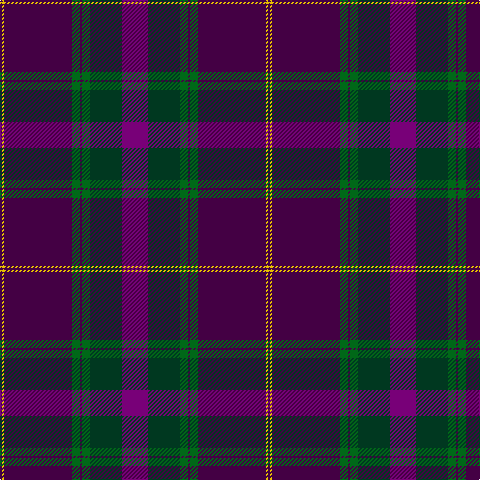

The parent of this is [Heather Mead (Personal)](/tartans/dp/2/y2/dp68/g8/dp2/g8/dg32/p/26/)

This was sourced from tartans-authority.  It is a [8 stripes tartan](/stripes/stripes8/).

Original link http://www.tartansauthority.com/tartan-ferret/display/10967/

## Thread count
DP/2 Y2 DP68 G8 DP2 G8 DG32 P/26

## Palette
Each colour and its ΔE from the base-6 reference it is a variant of.

| Colour | Shade | Base | ΔE (OKLab) |
|---|---|---|---|
| DG |  `#003820` | G  | 0.16 |
| DP |  `#440044` | B  | 0.17 |
| G |  `#006818` | G  | 0.02 |
| P |  `#780078` | B  | 0.16 |
| Y |  `#E8C000` | Y  | 0.00 |

# Sample pattern

ID: /variants/dp/2/y2/dp68/g8/dp2/g8/dg32/p/26-dg003820-dp440044-g006818-p780078-ye8c000/
