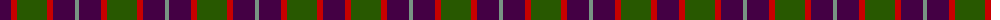

The parent of this is [Wilson's No.199](/tartans/dp/22/r6/g30/r6/dp22/lg4/dp22/r6/g30/r6/dp22/lg/4/)

This was sourced from register-of-tartans.  It is a [12 stripes tartan](/stripes/stripes12/).

Original link https://www.tartanregister.gov.uk/tartanDetails.aspx?ref=4731

## Thread count
DP/22 R6 G30 R6 DP22 LG4 DP22 R6 G30 R6 DP22 LG/4

## Palette
Each colour and its ΔE from the base-6 reference it is a variant of.

| Colour | Shade | Base | ΔE (OKLab) |
|---|---|---|---|
| DG |  `#003820` | G  | 0.16 |
| DP |  `#440044` | B  | 0.17 |
| G |  `#285800` | G  | 0.04 |
| LG |  `#789484` | G  | 0.23 |
| P |  `#780078` | B  | 0.16 |
| R |  `#C80000` | R  | 0.00 |
| Ra |  `#C80000` | R  | 0.00 |

ID: /variants/dp/22/r6/g30/r6/dp22/lg4/dp22/r6/g30/r6/dp22/lg/4-dg003820-dp440044-g285800-lg789484-p780078-rc80000-rac80000/
