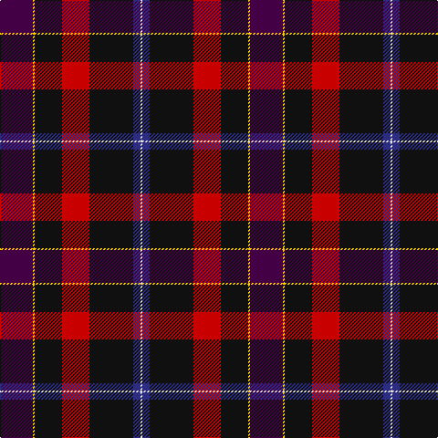

The parent of this is [European Congress of Immunology (Cor](/tartans/dp/36/y2/k30/r30/k48/db8/ln/2/)

This was sourced from tartans-authority.  It is a [7 stripes tartan](/stripes/stripes7/).

Original link http://www.tartansauthority.com/tartan-ferret/display/10683/

## Thread count
DP/36 Y2 K30 R30 K48 DB8 LN/2

## Palette
Each colour and its ΔE from the base-6 reference it is a variant of.

| Colour | Shade | Base | ΔE (OKLab) |
|---|---|---|---|
| DB |  `#2C2C80` | B  | 0.05 |
| DP |  `#440044` | B  | 0.17 |
| K |  `#101010` | K  | 0.17 |
| LN |  `#E0E0E0` | W  | 0.06 |
| R |  `#C80000` | R  | 0.00 |
| Y |  `#FCCC00` | Y  | 0.04 |

# Sample pattern

ID: /variants/dp/36/y2/k30/r30/k48/db8/ln/2-db2c2c80-dp440044-k101010-lne0e0e0-rc80000-yfccc00/
