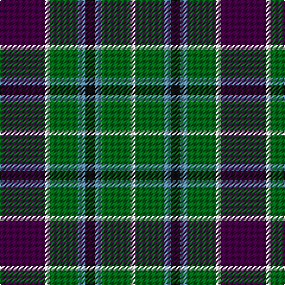

The parent of this is [Wilson's No.111](/tartans/dp/38/ln4/g24/b6/k8/b6/g24/ln/4/)

This was sourced from register-of-tartans.  It is a [8 stripes tartan](/stripes/stripes8/).

Original link https://www.tartanregister.gov.uk/tartanDetails.aspx?ref=4677

## Thread count
DP/38 LN4 G24 B6 K8 B6 G24 LN/4

## Palette
Each colour and its ΔE from the base-6 reference it is a variant of.

| Colour | Shade | Base | ΔE (OKLab) |
|---|---|---|---|
| B |  `#5C8CA8` | B  | 0.23 |
| DG |  `#003820` | G  | 0.16 |
| DP |  `#440044` | B  | 0.17 |
| G |  `#006818` | G  | 0.02 |
| K |  `#101010` | K  | 0.17 |
| LN |  `#E0E0E0` | W  | 0.06 |

# Sample pattern

ID: /variants/dp/38/ln4/g24/b6/k8/b6/g24/ln/4-b5c8ca8-dg003820-dp440044-g006818-k101010-lne0e0e0/
