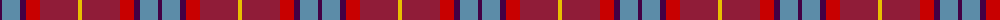

The parent of this is [Stevens #3](/tartans/dp/4/b18/dp6/r14/dr38/y/4/)

This was sourced from register-of-tartans.  It is a [6 stripes tartan](/stripes/stripes6/).

Original link https://www.tartanregister.gov.uk/tartanDetails.aspx?ref=3922

## Thread count
DP/4 B18 DP6 R14 DR38 Y/4

## Palette
Each colour and its ΔE from the base-6 reference it is a variant of.

| Colour | Shade | Base | ΔE (OKLab) |
|---|---|---|---|
| B |  `#5C8CA8` | B  | 0.23 |
| DP |  `#440044` | B  | 0.17 |
| DR |  `#901C38` | R  | 0.12 |
| LR |  `#E87878` | R  | 0.19 |
| P |  `#B468AC` | R  | 0.21 |
| R |  `#C80000` | R  | 0.00 |
| Y |  `#E8C000` | Y  | 0.00 |

# Sample pattern

ID: /variants/dp/4/b18/dp6/r14/dr38/y/4-b5c8ca8-dp440044-dr901c38-lre87878-pb468ac-rc80000-ye8c000/
