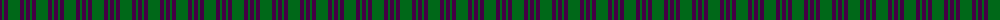
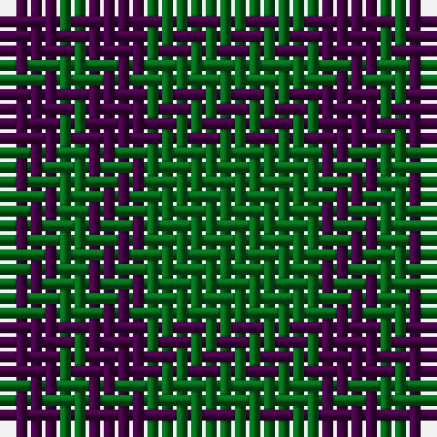

The parent of this is [Elphinstone Check (Clan)](/tartans/dp/4/g2/dp4/g/12/)

This was sourced from tartans-authority.  It is a [4 stripes tartan](/stripes/stripes4/).

Original link http://www.tartansauthority.com/tartan-ferret/display/115/

## Thread count
DP/4 G2 DP4 G/12

## Palette
Each colour and its ΔE from the base-6 reference it is a variant of.

| Colour | Shade | Base | ΔE (OKLab) |
|---|---|---|---|
| DP |  `#440044` | B  | 0.17 |
| G |  `#006818` | G  | 0.02 |

# Sample pattern

ID: /variants/dp/4/g2/dp4/g/12-dp440044-g006818/
