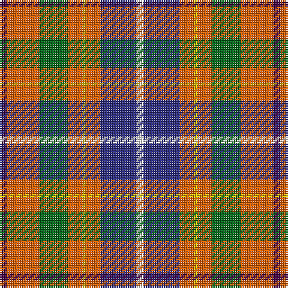

The parent of this is [de Maynard (Personal)](/tartans/dp/4/o18/g16/o8/y2/o8/db20/w/4/)

This was sourced from tartans-authority.  It is a [8 stripes tartan](/stripes/stripes8/).

Original link http://www.tartansauthority.com/tartan-ferret/display/5927/

## Thread count
DP/4 O18 G16 O8 Y2 O8 DB20 W/4

## Palette
Each colour and its ΔE from the base-6 reference it is a variant of.

| Colour | Shade | Base | ΔE (OKLab) |
|---|---|---|---|
| DB |  `#2C2C80` | B  | 0.05 |
| DP |  `#440044` | B  | 0.17 |
| G |  `#006818` | G  | 0.02 |
| O |  `#E86000` | R  | 0.14 |
| W |  `#FCFCFC` | W  | 0.03 |
| Y |  `#E8C000` | Y  | 0.00 |

# Sample pattern

ID: /variants/dp/4/o18/g16/o8/y2/o8/db20/w/4-db2c2c80-dp440044-g006818-oe86000-wfcfcfc-ye8c000/
