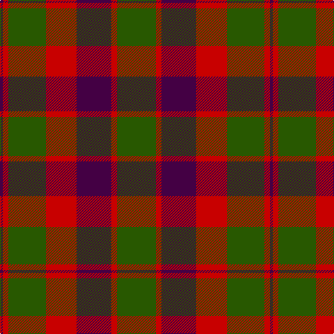

The parent of this is [Glasgow, Ciity of (District)](/tartans/dp/4/r8/g54/r44/dp50/r8/g/56/)

This was sourced from tartans-authority.  It is a [7 stripes tartan](/stripes/stripes7/).

Original link http://www.tartansauthority.com/tartan-ferret/display/515/

## Thread count
DP/4 R8 G54 R44 DP50 R8 G/56

## Palette
Each colour and its ΔE from the base-6 reference it is a variant of.

| Colour | Shade | Base | ΔE (OKLab) |
|---|---|---|---|
| DP |  `#440044` | B  | 0.17 |
| G |  `#285800` | G  | 0.04 |
| R |  `#C80000` | R  | 0.00 |

# Sample pattern

ID: /variants/dp/4/r8/g54/r44/dp50/r8/g/56-dp440044-g285800-rc80000/
