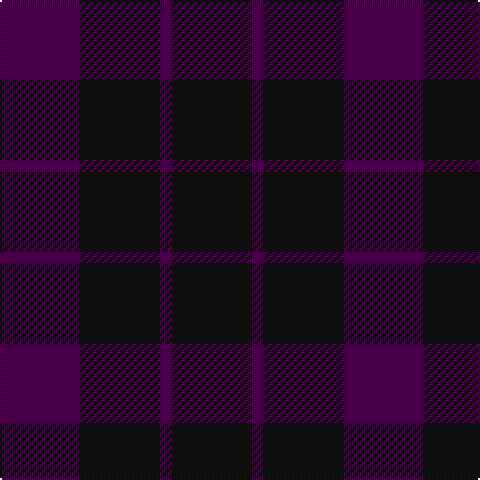

The parent of this is [Wcwm 9275-1333-1](/tartans/dp/40/k40/dp6/k/40/)

This was sourced from register-of-tartans.  It is a [4 stripes tartan](/stripes/stripes4/).

Original link https://www.tartanregister.gov.uk/tartanDetails.aspx?ref=4558

## Thread count
DP/40 K40 DP6 K/40

## Palette
Each colour and its ΔE from the base-6 reference it is a variant of.

| Colour | Shade | Base | ΔE (OKLab) |
|---|---|---|---|
| DP |  `#440044` | B  | 0.17 |
| K |  `#101010` | K  | 0.17 |

# Sample pattern

ID: /variants/dp/40/k40/dp6/k/40-dp440044-k101010/
