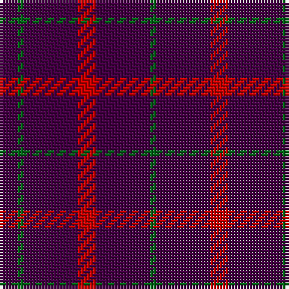

The parent of this is [Highland Spring (1988)](/tartans/dp/6/g2/dp18/r6/dp18/g/2/)

This was sourced from register-of-tartans.  It is a [6 stripes tartan](/stripes/stripes6/).

Original link https://www.tartanregister.gov.uk/tartanDetails.aspx?ref=1720

## Thread count
DP/6 G2 DP18 R6 DP18 G/2

## Palette
Each colour and its ΔE from the base-6 reference it is a variant of.

| Colour | Shade | Base | ΔE (OKLab) |
|---|---|---|---|
| DG |  `#003820` | G  | 0.16 |
| DP |  `#440044` | B  | 0.17 |
| G |  `#006818` | G  | 0.02 |
| R |  `#C80000` | R  | 0.00 |

# Sample pattern

ID: /variants/dp/6/g2/dp18/r6/dp18/g/2-dg003820-dp440044-g006818-rc80000/
