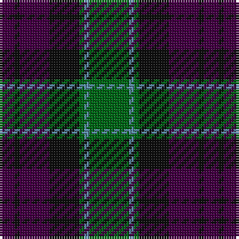

The parent of this is [Unnamed 19th Century Plaid](/tartans/dp/6/k2/dp12/k12/g2/b2/g/16/)

This was sourced from register-of-tartans.  It is a [7 stripes tartan](/stripes/stripes7/).

Original link https://www.tartanregister.gov.uk/tartanDetails.aspx?ref=4425

## Thread count
DP/6 K2 DP12 K12 G2 B2 G/16

## Palette
Each colour and its ΔE from the base-6 reference it is a variant of.

| Colour | Shade | Base | ΔE (OKLab) |
|---|---|---|---|
| B |  `#5C8CA8` | B  | 0.23 |
| DP |  `#440044` | B  | 0.17 |
| G |  `#006818` | G  | 0.02 |
| K |  `#101010` | K  | 0.17 |

# Sample pattern

ID: /variants/dp/6/k2/dp12/k12/g2/b2/g/16-b5c8ca8-dp440044-g006818-k101010/
