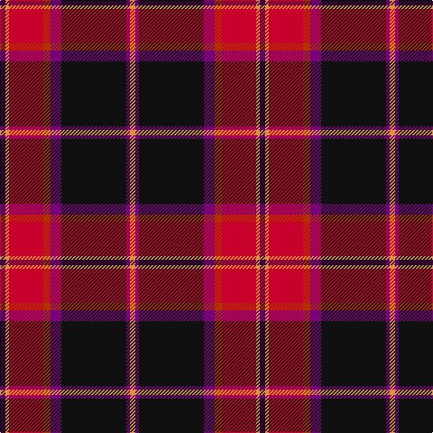

The parent of this is [Hyland Evening (Personal)](/tartans/dp/6/o4/r38/ra8/p12/k72/p4/o/6/)

This was sourced from tartans-authority.  It is a [8 stripes tartan](/stripes/stripes8/).

Original link http://www.tartansauthority.com/tartan-ferret/display/3829/

## Thread count
DP/6 O4 R38 Ra8 P12 K72 P4 O/6

## Palette
Each colour and its ΔE from the base-6 reference it is a variant of.

| Colour | Shade | Base | ΔE (OKLab) |
|---|---|---|---|
| DP |  `#440044` | B  | 0.17 |
| K |  `#101010` | K  | 0.17 |
| O |  `#DC943C` | Y  | 0.12 |
| P |  `#780078` | B  | 0.16 |
| R |  `#C8002C` | R  | 0.03 |
| Ra |  `#B03000` | R  | 0.05 |

# Sample pattern

ID: /variants/dp/6/o4/r38/ra8/p12/k72/p4/o/6-dp440044-k101010-odc943c-p780078-rc8002c-rab03000/
