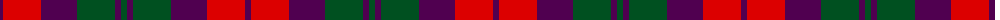
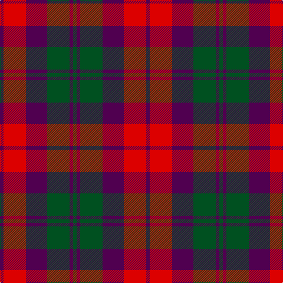

The parent of this is [MacNab (Macgregor - Hastie)](/tartans/dp/6/r38/dp36/g38/dp6/g/6/)

This was sourced from register-of-tartans.  It is a [6 stripes tartan](/stripes/stripes6/).

Original link https://www.tartanregister.gov.uk/tartanDetails.aspx?ref=2670

## Thread count
DP/6 R38 DP36 G38 DP6 G/6

## Palette
Each colour and its ΔE from the base-6 reference it is a variant of.

| Colour | Shade | Base | ΔE (OKLab) |
|---|---|---|---|
| DP |  `#500050` | B  | 0.16 |
| G |  `#005020` | G  | 0.08 |
| R |  `#DC0000` | R  | 0.04 |

# Sample pattern

ID: /variants/dp/6/r38/dp36/g38/dp6/g/6-dp500050-g005020-rdc0000/
