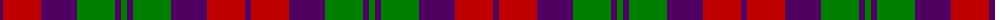
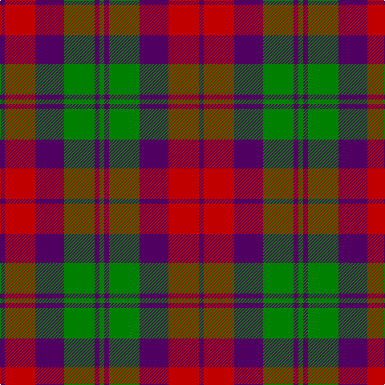

The parent of this is [MacNab 1](/tartans/dp/6/r38/dp36/g38/dp6/g/6/)

This was sourced from weddslist.  It is a [6 stripes tartan](/stripes/stripes6/).

Original link http://www.weddslist.com/cgi-bin/tartans/pg.pl?source=sts

## Thread count
DP/6 R38 DP36 G38 DP6 G/6

## Palette
Each colour and its ΔE from the base-6 reference it is a variant of.

| Colour | Shade | Base | ΔE (OKLab) |
|---|---|---|---|
| DP |  `#500060` | B  | 0.14 |
| G |  `#008000` | G  | 0.09 |
| R |  `#C00000` | R  | 0.02 |

# Sample pattern

ID: /variants/dp/6/r38/dp36/g38/dp6/g/6-dp500060-g008000-rc00000/
