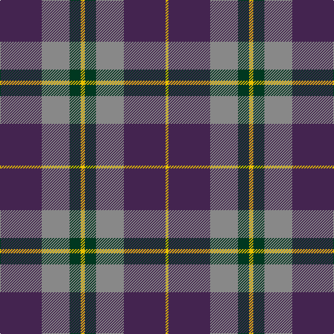

The parent of this is [Wicks Personal Tartan Tartan Number: 5968. Earliest known date: 2003 A tartan for the occasion of the marriage of Christopher Wicks and Nicola Bundle, in Aberdeen 2003. See products available Copyright © Blair Urquhart, Comrie, 2015](/tartans/dp/60/n40/dg16/y6/dg16/n40/dp60/y/4/)

This was sourced from house-of-tartan.  It is a [8 stripes tartan](/stripes/stripes8/).

Original link http://www.house-of-tartan.scotland.net/house/TartanViewjs.asp?colr=Def&tnam=5968

## Thread count
DP/60 N40 DG16 Y6 DG16 N40 DP60 Y/4

## Palette
Each colour and its ΔE from the base-6 reference it is a variant of.

| Colour | Shade | Base | ΔE (OKLab) |
|---|---|---|---|
| DG |  `#003820` | G  | 0.16 |
| DP |  `#442450` | B  | 0.11 |
| N |  `#888888` | R  | 0.24 |
| P |  `#780078` | B  | 0.16 |
| Y |  `#E8C000` | Y  | 0.00 |

# Sample pattern

ID: /variants/dp/60/n40/dg16/y6/dg16/n40/dp60/y/4-dg003820-dp442450-n888888-p780078-ye8c000/
