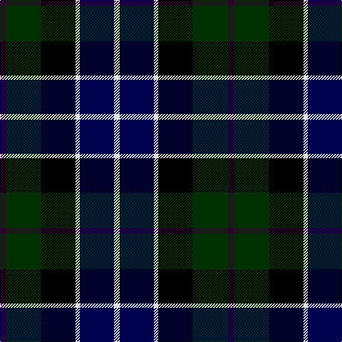

The parent of this is [Herd](/tartans/dp/8/dg50/k48/ln6/db48/ln/8/)

This was sourced from weddslist.  It is a [6 stripes tartan](/stripes/stripes6/).

Original link http://www.weddslist.com/cgi-bin/tartans/pg.pl?source=sts

## Thread count
DP/8 DG50 K48 LN6 DB48 LN/8

## Palette
Each colour and its ΔE from the base-6 reference it is a variant of.

| Colour | Shade | Base | ΔE (OKLab) |
|---|---|---|---|
| DB |  `#000050` | B  | 0.20 |
| DG |  `#003000` | G  | 0.18 |
| DP |  `#300030` | B  | 0.21 |
| K |  `#000000` | K  | 0.00 |
| LN |  `#E0E0E0` | W  | 0.06 |

# Sample pattern

ID: /variants/dp/8/dg50/k48/ln6/db48/ln/8-db000050-dg003000-dp300030-k000000-lne0e0e0/
