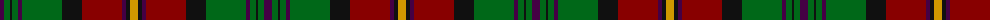

The parent of this is [Moffat (Fashion)](/tartans/dp/8/g6/k2/g6/dp4/g40/k20/dr40/dp4/k4/dy/8/)

This was sourced from tartans-authority.  It is a [11 stripes tartan](/stripes/stripes11/).

Original link http://www.tartansauthority.com/tartan-ferret/display/5674/

## Thread count
DP/8 G6 K2 G6 DP4 G40 K20 DR40 DP4 K4 DY/8

## Palette
Each colour and its ΔE from the base-6 reference it is a variant of.

| Colour | Shade | Base | ΔE (OKLab) |
|---|---|---|---|
| DP |  `#440044` | B  | 0.17 |
| DR |  `#880000` | R  | 0.14 |
| DY |  `#D09800` | Y  | 0.11 |
| G |  `#006818` | G  | 0.02 |
| K |  `#101010` | K  | 0.17 |

ID: /variants/dp/8/g6/k2/g6/dp4/g40/k20/dr40/dp4/k4/dy/8-dp440044-dr880000-dyd09800-g006818-k101010/
