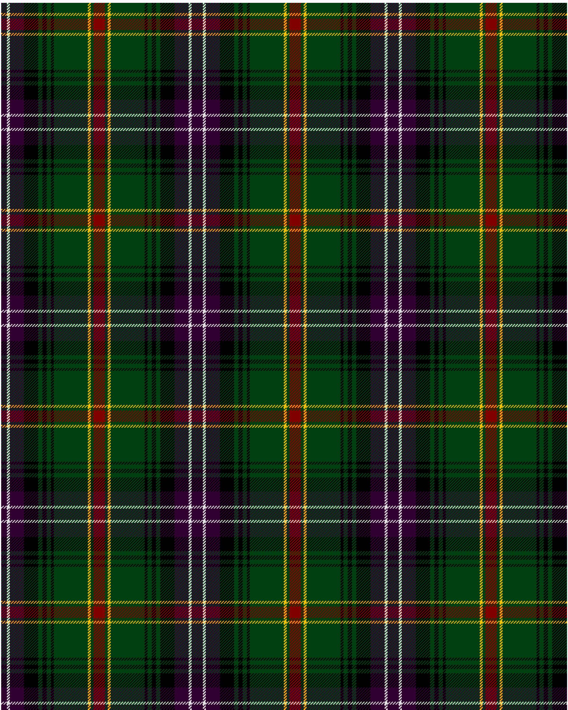

Kerby, from the Tennessee Cumberland Basin

This was sourced from <no value>.  It is a 12 stripes tartan.

Original link http://www.weddslist.com/cgi-bin/tartans/pg.pl?source=sts

## Thread count
DP/8 LN4 DP20 K20 DG6 K6 DG6 K4 DG48 Y4 DG4 DR/8

## Palette
DG#004010 DP#300030 DR#800000 K#000000 LN#E0E0E0 Y#F0C000

# Sample pattern

ID: /variants/dp/8/ln4/dp20/k20/dg6/k6/dg6/k4/dg48/y4/dg4/dr/8-dg004010-dp300030-dr800000-k000000-lne0e0e0-yf0c000