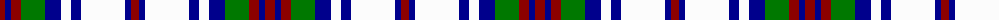

The parent of this is [Unidentified #56](/tartans/dr/10/db6/dr10/g24/db16/w10/db10/w44/db6/dr8/db6/w44/db10/w10/db16/g24/dr10/db6/dr/10/)

This was sourced from register-of-tartans.  It is a [19 stripes tartan](/stripes/stripes19/).

Original link https://www.tartanregister.gov.uk/tartanDetails.aspx?ref=4257

## Thread count
DR/10 DB6 DR10 G24 DB16 W10 DB10 W44 DB6 DR8 DB6 W44 DB10 W10 DB16 G24 DR10 DB6 DR/10

## Palette
Each colour and its ΔE from the base-6 reference it is a variant of.

| Colour | Shade | Base | ΔE (OKLab) |
|---|---|---|---|
| B |  `#788CB4` | B  | 0.25 |
| DB |  `#00008C` | B  | 0.13 |
| DR |  `#8C0000` | R  | 0.13 |
| DY |  `#C88C00` | Y  | 0.15 |
| G |  `#007800` | G  | 0.06 |
| K |  `#000000` | K  | 0.00 |
| P |  `#64008C` | B  | 0.13 |
| W |  `#FCFCFC` | W  | 0.03 |

ID: /variants/dr/10/db6/dr10/g24/db16/w10/db10/w44/db6/dr8/db6/w44/db10/w10/db16/g24/dr10/db6/dr/10-b788cb4-db00008c-dr8c0000-dyc88c00-g007800-k000000-p64008c-wfcfcfc/
