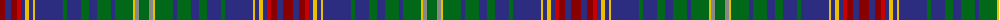

The parent of this is [Hart of Scotland (Corporate)](/tartans/dr/10/db6/dr6/r4/db4/y4/db4/y2/db28/g4/db14/g8/db8/g14/db4/g18/y2/n4/g/10/)

This was sourced from tartans-authority.  It is a [19 stripes tartan](/stripes/stripes19/).

Original link http://www.tartansauthority.com/tartan-ferret/display/4093/

## Thread count
DR/10 DB6 DR6 R4 DB4 Y4 DB4 Y2 DB28 G4 DB14 G8 DB8 G14 DB4 G18 Y2 N4 G/10

## Palette
Each colour and its ΔE from the base-6 reference it is a variant of.

| Colour | Shade | Base | ΔE (OKLab) |
|---|---|---|---|
| DB |  `#2C2C80` | B  | 0.05 |
| DR |  `#880000` | R  | 0.14 |
| G |  `#006818` | G  | 0.02 |
| N |  `#888888` | R  | 0.24 |
| R |  `#C80000` | R  | 0.00 |
| Y |  `#E8C000` | Y  | 0.00 |

ID: /variants/dr/10/db6/dr6/r4/db4/y4/db4/y2/db28/g4/db14/g8/db8/g14/db4/g18/y2/n4/g/10-db2c2c80-dr880000-g006818-n888888-rc80000-ye8c000/
