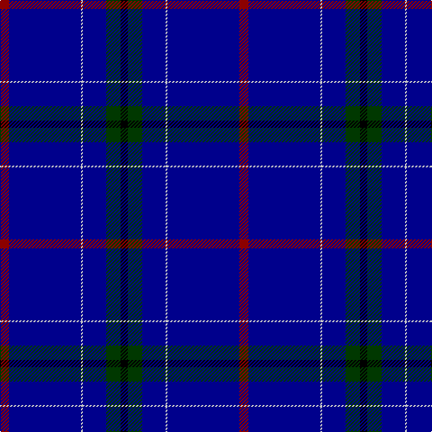

The parent of this is [London Caledonian Rugby Club](/tartans/dr/10/db80/n2/db26/g16/k/8/)

This was sourced from register-of-tartans.  It is a [6 stripes tartan](/stripes/stripes6/).

Original link https://www.tartanregister.gov.uk/tartanDetails.aspx?ref=2196

## Thread count
DR/10 DB80 N2 DB26 G16 K/8

## Palette
Each colour and its ΔE from the base-6 reference it is a variant of.

| Colour | Shade | Base | ΔE (OKLab) |
|---|---|---|---|
| DB |  `#00008C` | B  | 0.13 |
| DR |  `#8C0000` | R  | 0.13 |
| G |  `#003800` | G  | 0.15 |
| K |  `#000000` | K  | 0.00 |
| N |  `#C8C8C8` | W  | 0.13 |

# Sample pattern

ID: /variants/dr/10/db80/n2/db26/g16/k/8-db00008c-dr8c0000-g003800-k000000-nc8c8c8/
