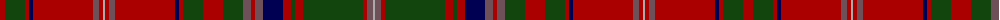

The parent of this is [MacDougall D](/tartans/dr/10/dg20/dr4/db4/dr60/n6/dr4/na2/dr4/n6/dr60/db4/dr4/dg20/dr20/dg20/n8/dr4/n8/db20/dr8/dg4/dr8/dg60/dr4/n6/na/2/)

This was sourced from weddslist.  It is a [27 stripes tartan](/stripes/stripes27/).

Original link http://www.weddslist.com/cgi-bin/tartans/pg.pl?source=x

## Thread count
DR/10 DG20 DR4 DB4 DR60 N6 DR4 Na2 DR4 N6 DR60 DB4 DR4 DG20 DR20 DG20 N8 DR4 N8 DB20 DR8 DG4 DR8 DG60 DR4 N6 Na/2

## Palette
Each colour and its ΔE from the base-6 reference it is a variant of.

| Colour | Shade | Base | ΔE (OKLab) |
|---|---|---|---|
| DB |  `#000052` | B  | 0.20 |
| DG |  `#11450D` | G  | 0.10 |
| DR |  `#AA0000` | R  | 0.06 |
| N |  `#6E5058` | B  | 0.14 |
| Na |  `#AAAAAA` | Y  | 0.19 |

ID: /variants/dr/10/dg20/dr4/db4/dr60/n6/dr4/na2/dr4/n6/dr60/db4/dr4/dg20/dr20/dg20/n8/dr4/n8/db20/dr8/dg4/dr8/dg60/dr4/n6/na/2-db000052-dg11450d-draa0000-n6e5058-naaaaaaa/
