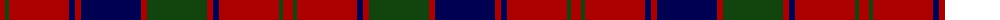

The parent of this is [Robertson D](/tartans/dr/10/dg4/dr60/db6/dr6/db60/dr6/dg60/dr6/db6/dr60/dg4/dr/10/)

This was sourced from weddslist.  It is a [13 stripes tartan](/stripes/stripes13/).

Original link http://www.weddslist.com/cgi-bin/tartans/pg.pl?source=tinsel

## Thread count
DR/10 DG4 DR60 DB6 DR6 DB60 DR6 DG60 DR6 DB6 DR60 DG4 DR/10

## Palette
Each colour and its ΔE from the base-6 reference it is a variant of.

| Colour | Shade | Base | ΔE (OKLab) |
|---|---|---|---|
| DB |  `#000052` | B  | 0.20 |
| DG |  `#11450D` | G  | 0.10 |
| DR |  `#AA0000` | R  | 0.06 |

ID: /variants/dr/10/dg4/dr60/db6/dr6/db60/dr6/dg60/dr6/db6/dr60/dg4/dr/10-db000052-dg11450d-draa0000/
