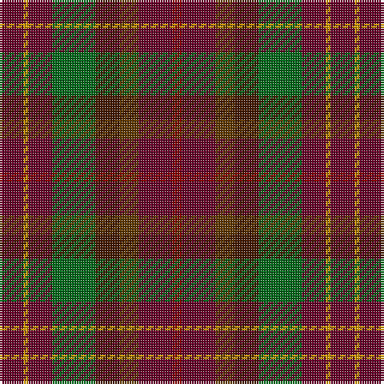

The parent of this is [Leighton (Personal)](/tartans/dr/10/dy2/dr10/g18/dra10/t8/dr14/drb/4/)

This was sourced from tartans-authority.  It is a [8 stripes tartan](/stripes/stripes8/).

Original link http://www.tartansauthority.com/tartan-ferret/display/2483/

## Thread count
DR/10 DY2 DR10 G18 DRa10 T8 DR14 DRb/4

## Palette
Each colour and its ΔE from the base-6 reference it is a variant of.

| Colour | Shade | Base | ΔE (OKLab) |
|---|---|---|---|
| DR |  `#680028` | B  | 0.20 |
| DRa |  `#441800` | B  | 0.22 |
| DRb |  `#880000` | R  | 0.14 |
| DY |  `#D09800` | Y  | 0.11 |
| G |  `#006818` | G  | 0.02 |
| T |  `#603800` | G  | 0.16 |

# Sample pattern

ID: /variants/dr/10/dy2/dr10/g18/dra10/t8/dr14/drb/4-dr680028-dra441800-drb880000-dyd09800-g006818-t603800/
