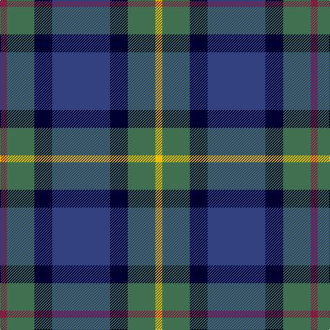

The parent of this is [Newmill](/tartans/dr/10/g40/db26/b84/db26/g40/y/10/)

This was sourced from weddslist.  It is a [7 stripes tartan](/stripes/stripes7/).

Original link http://www.weddslist.com/cgi-bin/tartans/pg.pl?source=sts

## Thread count
DR/10 G40 DB26 B84 DB26 G40 Y/10

## Palette
Each colour and its ΔE from the base-6 reference it is a variant of.

| Colour | Shade | Base | ΔE (OKLab) |
|---|---|---|---|
| B |  `#304080` | B  | 0.01 |
| DB |  `#000030` | K  | 0.17 |
| DR |  `#802040` | R  | 0.16 |
| G |  `#407050` | G  | 0.10 |
| Y |  `#F0C000` | Y  | 0.01 |

# Sample pattern

ID: /variants/dr/10/g40/db26/b84/db26/g40/y/10-b304080-db000030-dr802040-g407050-yf0c000/
