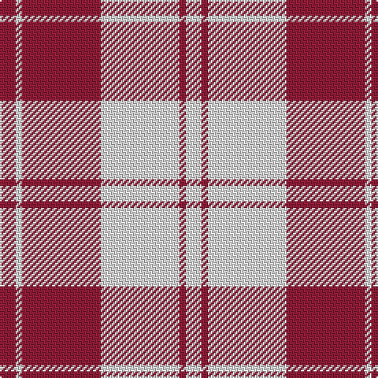

The parent of this is [Erskine Dress Burgandy Clan Tartan Tartan Number: 1972. Earliest known date: 1971 A popular Dress tartan for Scottish Highland Dancing. See products available Copyright © Blair Urquhart, Comrie, 2015](/tartans/dr/10/ln4/dr50/ln50/dr4/ln/10/)

This was sourced from house-of-tartan.  It is a [6 stripes tartan](/stripes/stripes6/).

Original link http://www.house-of-tartan.scotland.net/house/TartanViewjs.asp?colr=Def&tnam=1972

## Thread count
DR/10 LN4 DR50 LN50 DR4 LN/10

## Palette
Each colour and its ΔE from the base-6 reference it is a variant of.

| Colour | Shade | Base | ΔE (OKLab) |
|---|---|---|---|
| DR |  `#901C38` | R  | 0.12 |
| LN |  `#E0E0E0` | W  | 0.06 |

# Sample pattern

ID: /variants/dr/10/ln4/dr50/ln50/dr4/ln/10-dr901c38-lne0e0e0/
