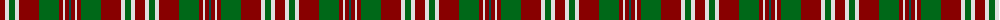

The parent of this is [Glenfinnan (Fashion)](/tartans/dr/10/ln4/g6/ln4/dr20/g20/dr4/ln2/dr4/ga/2/)

This was sourced from tartans-authority.  It is a [10 stripes tartan](/stripes/stripes10/).

Original link http://www.tartansauthority.com/tartan-ferret/display/3848/

## Thread count
DR/10 LN4 G6 LN4 DR20 G20 DR4 LN2 DR4 Ga/2

## Palette
Each colour and its ΔE from the base-6 reference it is a variant of.

| Colour | Shade | Base | ΔE (OKLab) |
|---|---|---|---|
| DR |  `#880000` | R  | 0.14 |
| G |  `#006818` | G  | 0.02 |
| Ga |  `#005448` | G  | 0.11 |
| LN |  `#E0E0E0` | W  | 0.06 |

ID: /variants/dr/10/ln4/g6/ln4/dr20/g20/dr4/ln2/dr4/ga/2-dr880000-g006818-ga005448-lne0e0e0/
