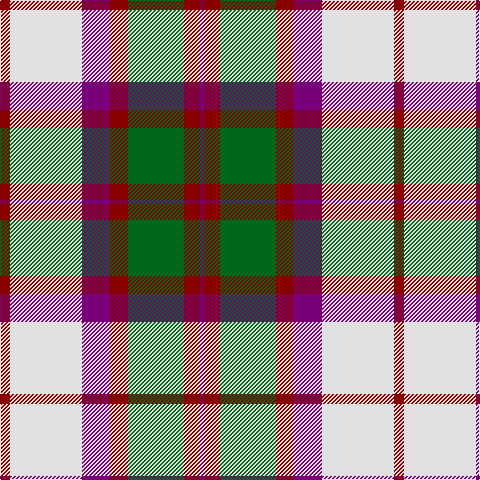

The parent of this is [MacKintosh (Artefact)](/tartans/dr/10/ln72/p28/dr18/g56/dr16/p/4/)

This was sourced from register-of-tartans.  It is a [7 stripes tartan](/stripes/stripes7/).

Original link https://www.tartanregister.gov.uk/tartanDetails.aspx?ref=2568

## Thread count
DR/10 LN72 P28 DR18 G56 DR16 P/4

## Palette
Each colour and its ΔE from the base-6 reference it is a variant of.

| Colour | Shade | Base | ΔE (OKLab) |
|---|---|---|---|
| DR |  `#880000` | R  | 0.14 |
| G |  `#006818` | G  | 0.02 |
| LN |  `#E0E0E0` | W  | 0.06 |
| P |  `#780078` | B  | 0.16 |

# Sample pattern

ID: /variants/dr/10/ln72/p28/dr18/g56/dr16/p/4-dr880000-g006818-lne0e0e0-p780078/
