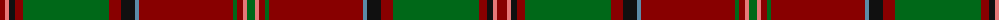

The parent of this is [Glen Coe (District)](/tartans/dr/10/lr4/k6/dr8/g86/dr12/k14/b4/dr94/g4/dr6/lr4/g/8/)

This was sourced from tartans-authority.  It is a [13 stripes tartan](/stripes/stripes13/).

Original link http://www.tartansauthority.com/tartan-ferret/display/3850/

## Thread count
DR/10 LR4 K6 DR8 G86 DR12 K14 B4 DR94 G4 DR6 LR4 G/8

## Palette
Each colour and its ΔE from the base-6 reference it is a variant of.

| Colour | Shade | Base | ΔE (OKLab) |
|---|---|---|---|
| B |  `#5C8CA8` | B  | 0.23 |
| DR |  `#880000` | R  | 0.14 |
| G |  `#006818` | G  | 0.02 |
| K |  `#101010` | K  | 0.17 |
| LR |  `#E87878` | R  | 0.19 |

ID: /variants/dr/10/lr4/k6/dr8/g86/dr12/k14/b4/dr94/g4/dr6/lr4/g/8-b5c8ca8-dr880000-g006818-k101010-lre87878/
