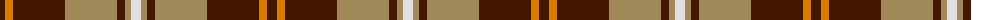

The parent of this is [Elgin District Tartan Tartan Number: 2196. Earliest known date: 1998 A sample of this tartan was recorded by the Scottish Tartans Society during the period 1970 to 1990. See products available Copyright © Blair Urquhart, Comrie, 2015](/tartans/dr/10/o8/dr52/lt52/dr8/lt6/ln/10/)

This was sourced from house-of-tartan.  It is a [7 stripes tartan](/stripes/stripes7/).

Original link http://www.house-of-tartan.scotland.net/house/TartanViewjs.asp?colr=Def&tnam=2196

## Thread count
DR/10 O8 DR52 LT52 DR8 LT6 LN/10

## Palette
Each colour and its ΔE from the base-6 reference it is a variant of.

| Colour | Shade | Base | ΔE (OKLab) |
|---|---|---|---|
| DR |  `#441800` | B  | 0.22 |
| LN |  `#E0E0E0` | W  | 0.06 |
| LT |  `#A08858` | Y  | 0.21 |
| O |  `#D87C00` | Y  | 0.17 |

# Sample pattern

ID: /variants/dr/10/o8/dr52/lt52/dr8/lt6/ln/10-dr441800-lne0e0e0-lta08858-od87c00/
