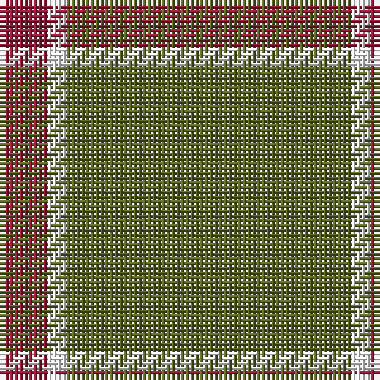

The parent of this is [Strategic Staffing Solutions (Corpor](/tartans/dr/10/w4/g/60/)

This was sourced from tartans-authority.  It is a [3 stripes tartan](/stripes/stripes3/).

Original link http://www.tartansauthority.com/tartan-ferret/display/6227/

## Thread count
DR/10 W4 G/60

## Palette
Each colour and its ΔE from the base-6 reference it is a variant of.

| Colour | Shade | Base | ΔE (OKLab) |
|---|---|---|---|
| DR |  `#901C38` | R  | 0.12 |
| G |  `#5C6428` | G  | 0.09 |
| W |  `#FCFCFC` | W  | 0.03 |

# Sample pattern

ID: /variants/dr/10/w4/g/60-dr901c38-g5c6428-wfcfcfc/
