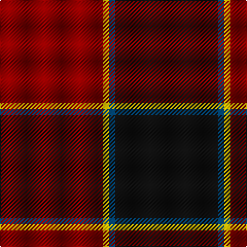

The parent of this is [Hungerford RFC Personal Tartan Tartan Number: 6488. Earliest known date: 2005 Bob Boulton designed his tartan online with House of Tartan, for the Hungerford rugby football club using club colours See products available Copyright © Blair Urquhart, Comrie, 2015](/tartans/dr/100/y6/db6/k/100/)

This was sourced from house-of-tartan.  It is a [4 stripes tartan](/stripes/stripes4/).

Original link http://www.house-of-tartan.scotland.net/house/TartanViewjs.asp?colr=Def&tnam=6488

## Thread count
DR/100 Y6 DB6 K/100

## Palette
Each colour and its ΔE from the base-6 reference it is a variant of.

| Colour | Shade | Base | ΔE (OKLab) |
|---|---|---|---|
| DB |  `#003C64` | B  | 0.07 |
| DR |  `#880000` | R  | 0.14 |
| K |  `#101010` | K  | 0.17 |
| Y |  `#E8C000` | Y  | 0.00 |

# Sample pattern

ID: /variants/dr/100/y6/db6/k/100-db003c64-dr880000-k101010-ye8c000/
