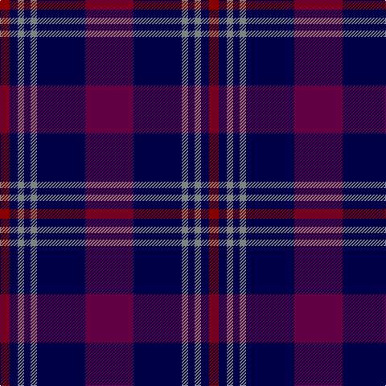

The parent of this is [Komissarov, Dmitry (Personal)](/tartans/dr/12/db10/n8/db8/n8/db60/dra/60/)

This was sourced from register-of-tartans.  It is a [7 stripes tartan](/stripes/stripes7/).

Original link https://www.tartanregister.gov.uk/tartanDetails.aspx?ref=11632

## Thread count
DR/12 DB10 N8 DB8 N8 DB60 DRa/60

## Palette
Each colour and its ΔE from the base-6 reference it is a variant of.

| Colour | Shade | Base | ΔE (OKLab) |
|---|---|---|---|
| DB |  `#000048` | B  | 0.21 |
| DR |  `#880000` | R  | 0.14 |
| DRa |  `#640044` | B  | 0.18 |
| N |  `#808080` | G  | 0.22 |

# Sample pattern

ID: /variants/dr/12/db10/n8/db8/n8/db60/dra/60-db000048-dr880000-dra640044-n808080/
