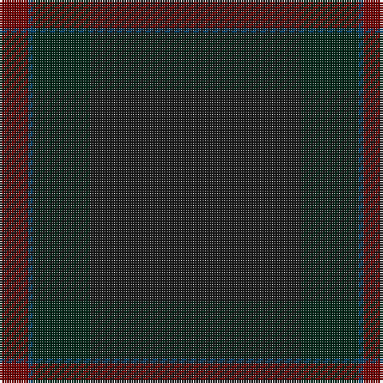

The parent of this is [Heslop, William D Name Tartan Tartan Number: 10331. Earliest known date: 2011 This tartan was created for the Heslop family descended from William Douglas Heslop, who was born on 1st December 1857. His father, John Heslop was born in Lurdenlaw by Kelso in 1825 and his mother, Jessie Turnbull, was born in Jedburgh in 1826. They married in 1849 and sailed to the USA. The tartan may be worn by anyone with the surname Heslop. The copyright owner is William D Heslop. See products available Copyright © Blair Urquhart, Comrie, 2015](/tartans/dr/12/db2/dg24/k/88/)

This was sourced from house-of-tartan.  It is a [4 stripes tartan](/stripes/stripes4/).

Original link http://www.house-of-tartan.scotland.net/house/TartanViewjs.asp?colr=Def&tnam=10331

## Thread count
DR/12 DB2 DG24 K/88

## Palette
Each colour and its ΔE from the base-6 reference it is a variant of.

| Colour | Shade | Base | ΔE (OKLab) |
|---|---|---|---|
| DB |  `#003C64` | B  | 0.07 |
| DG |  `#002414` | B  | 0.22 |
| DR |  `#700000` | R  | 0.20 |
| G |  `#006818` | G  | 0.02 |
| K |  `#181818` | K  | 0.21 |
| O |  `#E86000` | R  | 0.14 |

# Sample pattern

ID: /variants/dr/12/db2/dg24/k/88-db003c64-dg002414-dr700000-g006818-k181818-oe86000/
