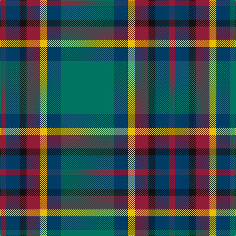

The parent of this is [Gloucester County Pipe Band (Corp)](/tartans/dr/12/db28/k14/dr28/y14/db28/g/108/)

This was sourced from tartans-authority.  It is a [7 stripes tartan](/stripes/stripes7/).

Original link http://www.tartansauthority.com/tartan-ferret/display/7539/

## Thread count
DR/12 DB28 K14 DR28 Y14 DB28 G/108

## Palette
Each colour and its ΔE from the base-6 reference it is a variant of.

| Colour | Shade | Base | ΔE (OKLab) |
|---|---|---|---|
| DB |  `#003C64` | B  | 0.07 |
| DR |  `#901C38` | R  | 0.12 |
| G |  `#007460` | G  | 0.11 |
| K |  `#101010` | K  | 0.17 |
| Y |  `#E8C000` | Y  | 0.00 |

# Sample pattern

ID: /variants/dr/12/db28/k14/dr28/y14/db28/g/108-db003c64-dr901c38-g007460-k101010-ye8c000/
