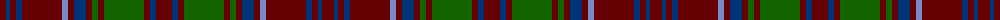

The parent of this is [Glenfarclas Distillery (Corporate)](/tartans/dr/12/db4/dr6/db6/dr40/b6/dr6/db12/dr6/g6/dr6/g40/dr6/db6/dr/16/)

This was sourced from tartans-authority.  It is a [15 stripes tartan](/stripes/stripes15/).

Original link http://www.tartansauthority.com/tartan-ferret/display/4237/

## Thread count
DR/12 DB4 DR6 DB6 DR40 B6 DR6 DB12 DR6 G6 DR6 G40 DR6 DB6 DR/16

## Palette
Each colour and its ΔE from the base-6 reference it is a variant of.

| Colour | Shade | Base | ΔE (OKLab) |
|---|---|---|---|
| B |  `#788CCC` | B  | 0.26 |
| DB |  `#003478` | B  | 0.06 |
| DR |  `#640000` | R  | 0.22 |
| G |  `#146400` | G  | 0.01 |

ID: /variants/dr/12/db4/dr6/db6/dr40/b6/dr6/db12/dr6/g6/dr6/g40/dr6/db6/dr/16-b788ccc-db003478-dr640000-g146400/
