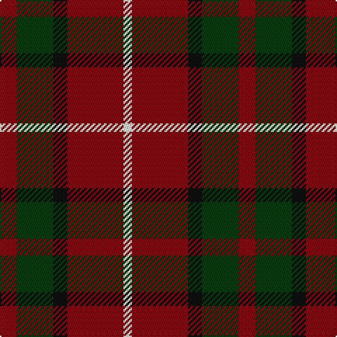

The parent of this is [Ryutokukan Junior High School Tartan Tartan Number: 10647. Earliest known date: 20/04/2012 A tartan for this highly respected junior high school reflecting dignity and intelligence. See products available Copyright © Blair Urquhart, Comrie, 2015](/tartans/dr/12/dg26/k10/dr40/ly/6/)

This was sourced from house-of-tartan.  It is a [5 stripes tartan](/stripes/stripes5/).

Original link http://www.house-of-tartan.scotland.net/house/TartanViewjs.asp?colr=Def&tnam=10647

## Thread count
DR/12 DG26 K10 DR40 LY/6

## Palette
Each colour and its ΔE from the base-6 reference it is a variant of.

| Colour | Shade | Base | ΔE (OKLab) |
|---|---|---|---|
| DG |  `#003D0D` | G  | 0.13 |
| DR |  `#880110` | R  | 0.14 |
| K |  `#101010` | K  | 0.17 |
| LY |  `#FBF8D7` | W  | 0.04 |

# Sample pattern

ID: /variants/dr/12/dg26/k10/dr40/ly/6-dg003d0d-dr880110-k101010-lyfbf8d7/
