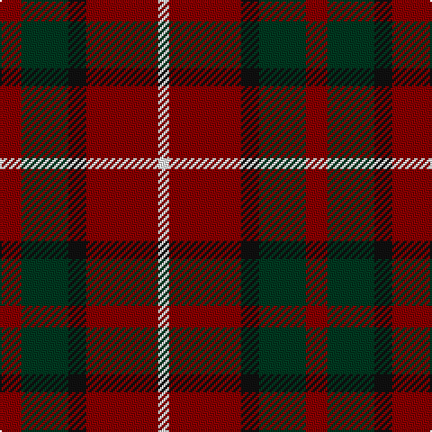

The parent of this is [Ryutokukan Junior High School (Corp)](/tartans/dr/12/dg26/k10/dr40/w/6/)

This was sourced from tartans-authority.  It is a [5 stripes tartan](/stripes/stripes5/).

Original link http://www.tartansauthority.com/tartan-ferret/display/10647/

## Thread count
DR/12 DG26 K10 DR40 W/6

## Palette
Each colour and its ΔE from the base-6 reference it is a variant of.

| Colour | Shade | Base | ΔE (OKLab) |
|---|---|---|---|
| DG |  `#003820` | G  | 0.16 |
| DR |  `#880000` | R  | 0.14 |
| K |  `#101010` | K  | 0.17 |
| W |  `#FCFCFC` | W  | 0.03 |

# Sample pattern

ID: /variants/dr/12/dg26/k10/dr40/w/6-dg003820-dr880000-k101010-wfcfcfc/
