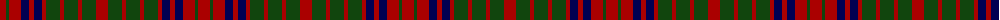

The parent of this is [Grant of Monymusk](/tartans/dr/12/dg3/dr12/db8/dr5/db8/dr4/dg14/dr4/dg14/dr4/dg14/dr/12/)

This was sourced from weddslist.  It is a [13 stripes tartan](/stripes/stripes13/).

Original link http://www.weddslist.com/cgi-bin/tartans/pg.pl?source=x

## Thread count
DR/12 DG3 DR12 DB8 DR5 DB8 DR4 DG14 DR4 DG14 DR4 DG14 DR/12

## Palette
Each colour and its ΔE from the base-6 reference it is a variant of.

| Colour | Shade | Base | ΔE (OKLab) |
|---|---|---|---|
| DB |  `#000052` | B  | 0.20 |
| DG |  `#11450D` | G  | 0.10 |
| DR |  `#AA0000` | R  | 0.06 |

ID: /variants/dr/12/dg3/dr12/db8/dr5/db8/dr4/dg14/dr4/dg14/dr4/dg14/dr/12-db000052-dg11450d-draa0000/
