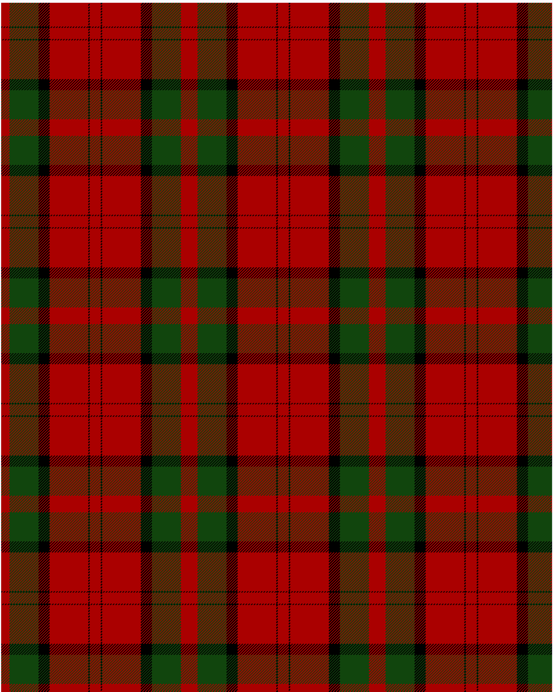

The parent of this is [Dunbar](/tartans/dr/12/dg42/k16/dr56/k2/dr/8/)

This was sourced from <no value>.  It is a [6 stripes tartan](/stripes/stripes6/).

Original link http://www.weddslist.com/cgi-bin/tartans/pg.pl?source=tinsel

## Thread count
DR/12 DG42 K16 DR56 K2 DR/8

## Palette
DG DR K

# Sample pattern

ID: /variants/dr/12/dg42/k16/dr56/k2/dr/8-dg11450d-draa0000-k000000/