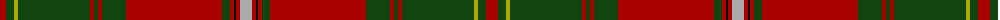

The parent of this is [Hay](/tartans/dr/12/dg8/lg4/dg72/dr4/dg4/dr4/dg24/dr96/dg8/dr4/k2/dr4/n/12/)

This was sourced from weddslist.  It is a [14 stripes tartan](/stripes/stripes14/).

Original link http://www.weddslist.com/cgi-bin/tartans/pg.pl?source=x

## Thread count
DR/12 DG8 LG4 DG72 DR4 DG4 DR4 DG24 DR96 DG8 DR4 K2 DR4 N/12

## Palette
Each colour and its ΔE from the base-6 reference it is a variant of.

| Colour | Shade | Base | ΔE (OKLab) |
|---|---|---|---|
| DG |  `#11450D` | G  | 0.10 |
| DR |  `#AA0000` | R  | 0.06 |
| K |  `#000000` | K  | 0.00 |
| LG |  `#AAAA00` | Y  | 0.11 |
| N |  `#AAAAAA` | Y  | 0.19 |

ID: /variants/dr/12/dg8/lg4/dg72/dr4/dg4/dr4/dg24/dr96/dg8/dr4/k2/dr4/n/12-dg11450d-draa0000-k000000-lgaaaa00-naaaaaa/
