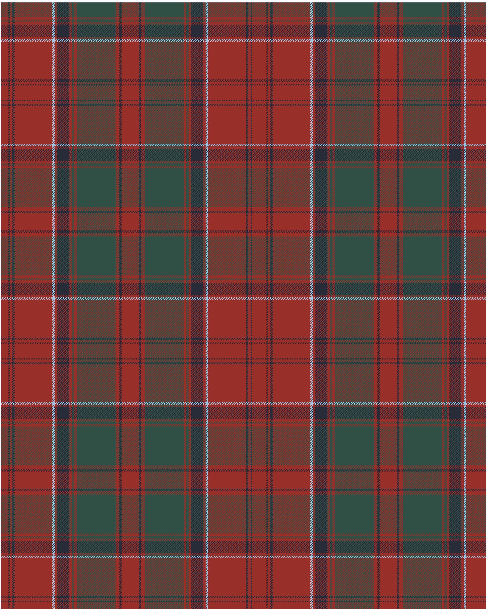

Drummond of Megginch 1997 Kilt

Drummond of Megginch 1997 Kilt

This was sourced from <no value>.  It is a 15 stripes tartan.

Original link https://tartandictionary.org/posts/drummondsofmegginchkilt/

## Thread count
DR/12 DN2 DR4 DN4 DR62 LB4 DR4 DN20 DR4 N4 DR4 N64 DR6 DN4 DR/14

## Palette
DN#282C39 DR#983029 LB#98C8E8 N#304F45

# Sample pattern

ID: /variants/dr/12/dn2/dr4/dn4/dr62/lb4/dr4/dn20/dr4/n4/dr4/n64/dr6/dn4/dr/14-dn282c39-dr983029-lb98c8e8-n304f45/